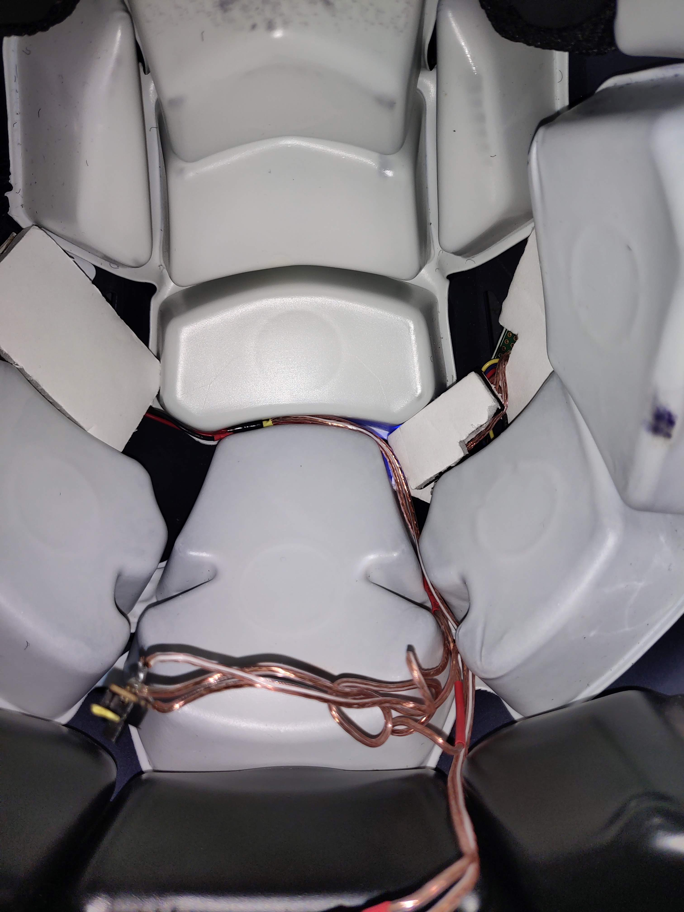

# Helmet Concussion Sensor
Code for Raspberry Pi Zero W and adxl 345 accelerometer to sense g forces and inform football coaches of severe force on a players head in real time

### Reason for Development
1. To provide a less expensive alternative of helmet concussion sensors for highschools (materials costing only up to 50 usd for each unit)
2. Provides real time data to coaches during football games to create a safer environment for highschool football players

### Hardware
[Raspberry Pi Zero W](https://www.adafruit.com/product/3400), [ADXL 345 accelerometer](https://www.adafruit.com/product/1231), [Pimoroni LiPo SHIM](https://www.adafruit.com/product/3196), any size 3.7v [lithium ion battery](https://www.adafruit.com/?q=lithihium%20ion), and a 
[Raspberry Pi 3 B](https://www.adafruit.com/product/3055) for the central server for every Raspberry Pi Zero W

### Networking (connecting the Pi Zero to the Pi 3 B)
The Pi Zero is inside the padding of the football player's helmet and processes all data from the accelerometer in real time. Then it sends a file with the severity of a hit if it is over a certain gForce threshold to the Pi 3 B which is in the coach's possession. The Pi Zero is connected to the Pi 3 B through ssh on the same wifi server.

### Assembled Device

Concussion sensor inside helmet with the addition of on/off switch that allowed for charging of battery without removing it from the helmet.

### Reason for Discontinuation of Development
After extensive testing with the Lausanne Collegiate School Varisty Football team and lengthy online research, I concluded that it would be next to impossible to produce a product that provided accurate readings of concussions without a full scale labratory to test impact forces and times. I could not accurately detect the timings of hits experienced with the onboard clock in the raspberry pi. I could not use accelerometers that had a higher gforce detection ceiling without creating my own libraries or switching to a different platform, which was outside of my ability.
